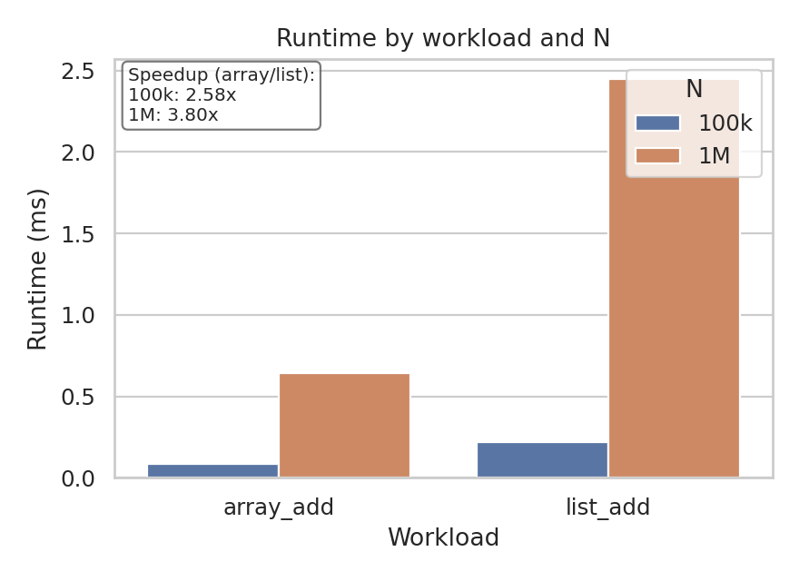
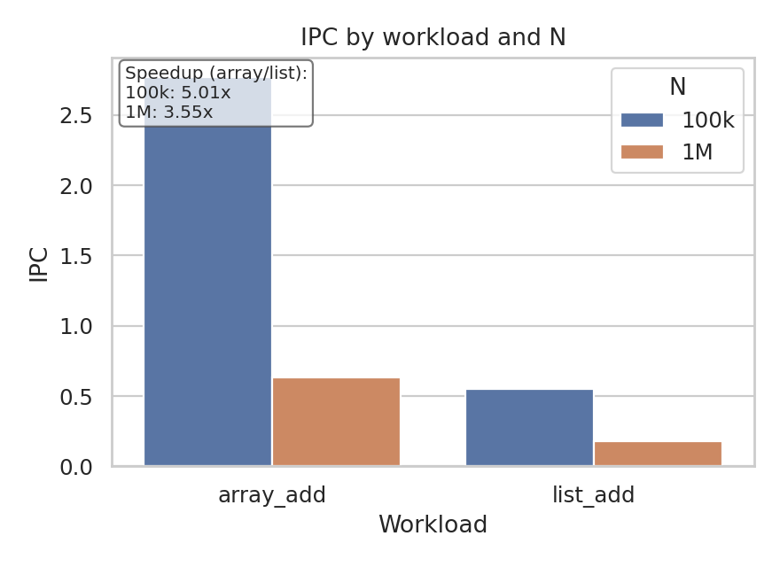
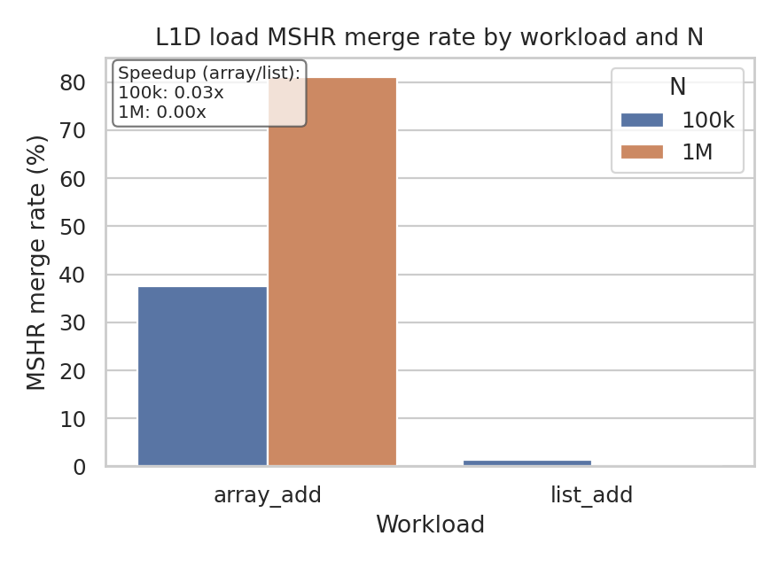

# Pointer chasing vs streaming (ChampSim)

This repo studies the performance penalty of summing N integers in a linked list compared to an array. The common claim is that the gap is explained by cache miss rates; the results here point instead to load serialization as the dominant cause.

Goal: run instruction traces of both programs through ChampSim, a cycle-accurate out-of-order core + cache/memory hierarchy simulator.

Key result: cache miss rates do not explain the slowdown. With lower MSHR pressure, the linked list shows ~0 load issue parallelism, while the array version sustains ~80% load parallelism.

Results (generated by `notebooks/analysis.ipynb`):

The wall-clock runtime shows a clear array vs list speedup across N; the array version finishes substantially faster even as the problem size grows.


IPC tracks the expected streaming advantage: arrays sustain higher IPC because independent loads can stay in flight, while pointer chasing throttles issue.


The cache miss ratio is counterintuitive: the array has a higher L1D miss rate than the list, yet it still runs faster.


The L1D MSHR merge rate explains both the high miss rate and the performance improvement. Arrays issue parallel loads, which creates more miss opportunities, but those misses are merged and overlapped in the MSHRs. Linked lists serialize loads, so the merge rate stays near zero and the core stalls on each dependent miss.


## Workloads

- `array_add`: streaming sum over a heap array
- `list_add`: pointer-chasing sum over a heap list
- `array_add_stack`: streaming sum over a stack array
- `list_add_stack`: pointer-chasing sum over a stack list

## Quick start

**System prerequisites (install via your package manager):**

- git, gcc/g++, make, cmake, ninja-build, pkg-config
- python3 + pip
- ca-certificates
- zip, unzip, curl, tar

If the setup host doesn’t already have these and you have passwordless sudo, you can opt-in to letting the setup script install them by setting `SETUP_INSTALL_SYSTEM_DEPS=1`. Otherwise, install them manually before running the steps below.

1) Setup + build ChampSim
```bash
./setup_scripts/setup.sh
```

2) Build workloads (trace + non-trace)
```bash
./scripts/build_workloads.sh
```

3) Generate traces (PIN → ChampSim trace)
```bash
./scripts/gen_traces.sh                 # heap only
./scripts/gen_traces.sh --include-stack
./scripts/gen_traces.sh --regen-traces  # force retracing
```

4) Run ChampSim on existing traces
```bash
./scripts/run_traces.sh                 # heap only
./scripts/run_traces.sh --include-stack
./scripts/run_traces.sh --run-metrics
```

5) Run native binaries
```bash
./scripts/run_native.sh                 # heap only
./scripts/run_native.sh --include-stack
```

## Workload config (simplified)

All knobs live in `config/workloads.conf`:

- `WORKLOADS`: ordered list of workload names.
- `WORKLOAD_N` or `WORKLOAD_N_LIST`: problem size(s).
- `CHAMPSIM_WARMUP_INSTRUCTIONS` / `CHAMPSIM_SIM_INSTRUCTIONS`: global budgets (optional `_LIST` variants when sweeping N).
- `warmup_cycles_<name>` / `sim_cycles_<name>`: per-workload overrides (optional `_list` variants).
- `stack_<name>`: marks stack workloads for `--include-stack` / `--stack-only`.

Budgets are used as-is (no scaling by N). Both `scripts/gen_traces.sh` and `scripts/run_traces.sh` read this file.

## Tracing prerequisites (Intel PIN)

ChampSim simulates from traces. This repo uses ChampSim's bundled Intel PIN tracer under `third_party/champsim/tracer/pin`.

Set `PIN_ROOT=/path/to/pin-*/` (must contain `$PIN_ROOT/pin`). If unset, `scripts/gen_traces.sh` stops and reports missing traces under `traces/`.

## Artifacts

- Traces: `traces/<workload>/<workload>_n=<N>.champsimtrace.xz` (+ `latest.champsimtrace` symlink)
- Trace logs: `results/pin_tool_logs/<workload>/*.out|*.err`
- ChampSim outputs: `results/champsim_results/<workload>_<N>/sim.txt|sim.err`
- Native outputs: `results/non-trace/<workload>_<N>/run.txt|run.err`
- Metrics reports: `analysis/metrics/report.md` (or `analysis/metrics/report_<N>.md`)

## Analyze

Open `notebooks/analysis.ipynb`.
